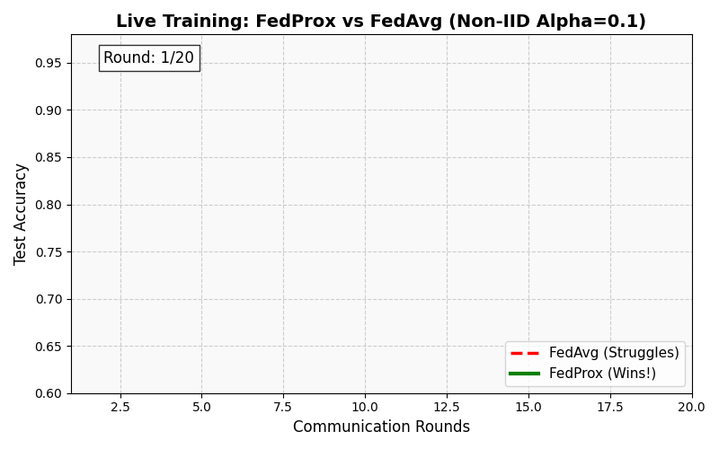

# FL-NonIID-Benchmark

<div align="center">
  <a href="https://git.io/typing-svg">
    
  </a>
</div>

<p align="center">
  <a href="https://colab.research.google.com/github/noushad999/FL-NonIID-Benchmark/blob/main/FL_NonIID_Benchmark.ipynb">
    
  </a>
  
  
</p>

---
# FL-NonIID-Benchmark

<div align="center">
  <a href="https://git.io/typing-svg">
    
  </a>
</div>

<p align="center">
  <a href="https://colab.research.google.com/github/noushad999/FL-NonIID-Benchmark/blob/main/FL_NonIID_Benchmark.ipynb">
    
  </a>
  
  
</p>

---

## 📖 What is this Project? (The "Why")

This project builds a **Privacy-Preserving AI System** designed to detect cyber-attacks in **IoT (Internet of Things)** networks (like smart home devices, sensors, etc.).

In the real world, collecting sensitive data from millions of user devices to a central server is a huge privacy risk. **Federated Learning (FL)** solves this by training the AI *on the device itself*, so raw data never leaves the user's phone or sensor.

**But there is a catch:** Real-world data is messy (**Non-IID**).
* Device A might only see "DDoS Attacks".
* Device B might only see "Normal Traffic".

Standard FL algorithms fail in this chaotic environment. This project **benchmarks and solves** that failure, identifying exactly which algorithms work when data is scattered and messy.

---

### 🧠 The Challenge: "Chaos vs. Consensus"
This project stress-tests Federated Learning (FL) to answer a critical question: **When should we use `FedProx` over `FedAvg`, and what is the *true* cost of privacy?**

I built a comprehensive PyTorch benchmark analyzing **Non-IID data** (Dirichlet distribution) on the TON_IoT dataset.

### 📊 Live Visualization: The "Tipping Point"
Watch how **FedProx** (Green) successfully learns in an extreme Non-IID environment ($\alpha=0.1$), while the standard **FedAvg** (Red) struggles to converge.

<p align="center">
  
</p>

---
### 🧠 The Challenge: "Chaos vs. Consensus"
This project stress-tests Federated Learning (FL) to answer a critical question: **When should we use `FedProx` over `FedAvg`, and what is the *true* cost of privacy?**

I built a comprehensive PyTorch benchmark analyzing **Non-IID data** (Dirichlet distribution) on the TON_IoT dataset.

### 📊 Live Visualization: The "Tipping Point"
Watch how **FedProx** (Green) successfully learns in an extreme Non-IID environment ($\alpha=0.1$), while the standard **FedAvg** (Red) struggles to converge.

<p align="center">
  
</p>

---

## 💡 Key Research Findings

Based on rigorous experimentation (Phase 3 of the benchmark), here are the novel findings:

1.  **🏆 Finding 1: The "Gold Standard" (Centralized XGBoost Wins)**
    Before even *touching* Federated Learning, a centralized `XGBoost` model achieved a near-perfect **F1-score of 0.9962**, beating all centralized Deep Learning models (MLP, CNN, Transformer). This serves as our performance ceiling.

2.  **💸 Finding 2: The "Cost of Privacy" is ~5.74%**
    The best-performing FL model (`FedAvg` in an IID setting) achieved an F1-score of 0.9388. This means the measurable "Cost of Privacy"—the performance sacrificed to keep data decentralized—is **~5.74% F1-score**.

3.  **📈 Finding 3: The "FedProx Tipping Point" (Alpha = 0.1)**
    `FedProx` is **not** a universal solution.
    * **IID-like ($\alpha=10.0$):** `FedAvg` is superior (F1 0.9388).
    * **Extreme Non-IID ($\alpha=0.1$):** `FedProx` provides a clear **+0.71% F1-score improvement**, proving its value for specialist clients.

4.  **🐞 Finding 4: The "Catastrophic Failure" (Alpha = 0.5)**
    `FedProx` is hyper-sensitive. At a specific moderate skew ($\alpha=0.5$), the algorithm failed catastrophically, dropping to an **F1-score of 0.0000**, highlighting the need for careful hyperparameter tuning (`mu`).

---

## 🚀 Getting Started

The easiest way to reproduce these results is via Google Colab.

<a href="https://colab.research.google.com/github/noushad999/FL-NonIID-Benchmark/blob/main/FL_NonIID_Benchmark.ipynb">
    
</a>

### Local Installation

```bash
# 1. Clone the repo
git clone [https://github.com/noushad999/FL-NonIID-Benchmark.git](https://github.com/noushad999/FL-NonIID-Benchmark.git)
cd FL-NonIID-Benchmark

# 2. Install dependencies
pip install -r requirements.txt

# 3. Run the benchmark
# (Ensure you have the dataset or run the script to download it)
python FL_NonIID_Benchmark.py
````

-----

## 📁 Repository Structure

```
FL-NonIID-Benchmark/
│
├── FL_NonIID_Benchmark.ipynb   # Main research notebook (Colab)
├── .gitignore                  # Configuration to ignore data/models
├── LICENSE                     # MIT License
├── README.md                   # Project Documentation
│
└── images/
    ├── training_comparison.gif  # Animation
    └── findings_table.png             # Summary Table (Optional)
```

-----

## 📜 Citation

If you use this benchmark in your research, please cite:

```bibtex
@misc{Noushad2025FLBenchmark,
  author = {Noushad Jahan Ramim},
  title  = {A Novel Benchmark of Federated Learning for Non-IID Anomaly Detection},
  year   = {2025},
  publisher = {GitHub},
  journal = {GitHub repository},
  howpublished = {\url{[https://github.com/noushad999/FL-NonIID-Benchmark](https://github.com/noushad999/FL-NonIID-Benchmark)}}
}
```

-----

## 🤝 Contributing

Pull requests are welcome. For major changes, please open an issue first to discuss what you would like to change.

**License:** [MIT](https://www.google.com/search?q=LICENSE)

